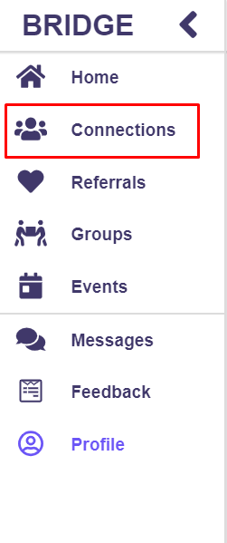
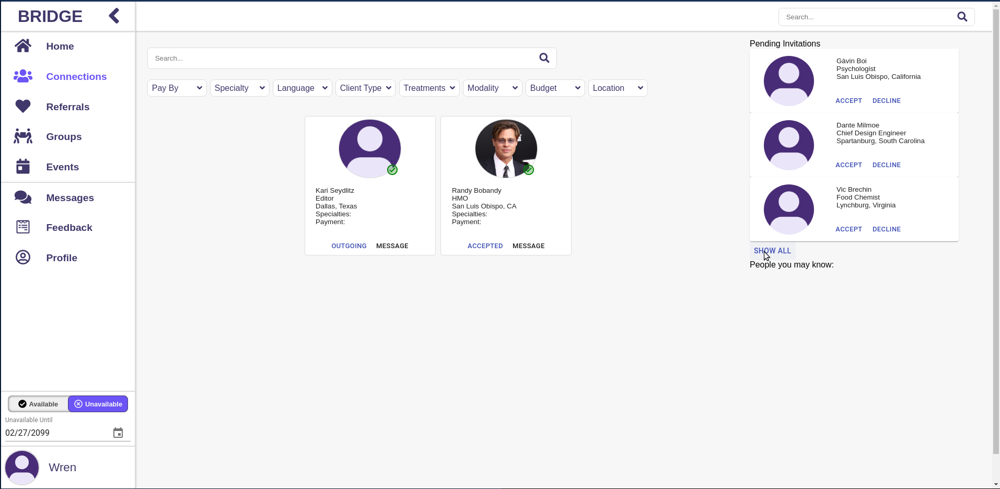

# Connections

---

## Accessing Connections
1. Click on the “Connections” button in the nav bar.

## Connections Search
1. Click on the “Connections” button in the nav bar.
2. Repeat the steps in "Searching -> General Search with filters" to search through your own connections.

## Pending Invitations
1. Click on the “Connections” button in the nav bar.
2. Navigate to the “Pending Invitations” section on the right side of the page.

3. Clicking any connection will bring you to their profile (the buttons don't currently do anything).
4. Click the “show all” button to open a modal of pending invitations.
5. Click the “close” button to escape the modal.

