# Profile Management

---

## Accessing Your Profile

1. Find the navigation bar on the left hand side.

    > 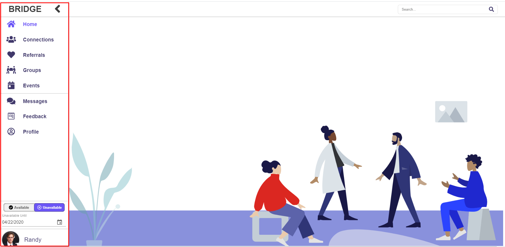

2. Select your icon on the bottom of the navigation bar.

    > 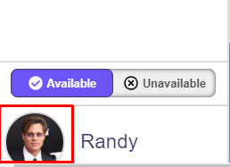

## Accessing Someone Else’s Profile

1. When you see a listing of other clinicians, (i.e "Connection Requests" on Dashboard, Connections tab, or Search tab), simply click on the user’s icon to be moved to their profile. This will allow you to view the clinician's information and potentially connect, refer, or message that clinician among other features.

## Editing Your Profile

1. Navigate to your own profile (see Accessing your profile above).
2. Hit the “Edit” button in the upper right corner of your profile.

    > 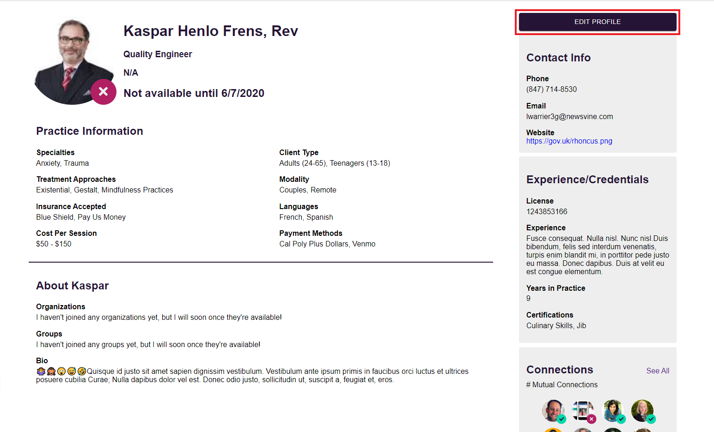

3. Your profile will now display a modal with tabs for each corresponding section on your profile. Under each tab you will find text boxes to add, delete, or edit the information in each field.

    > 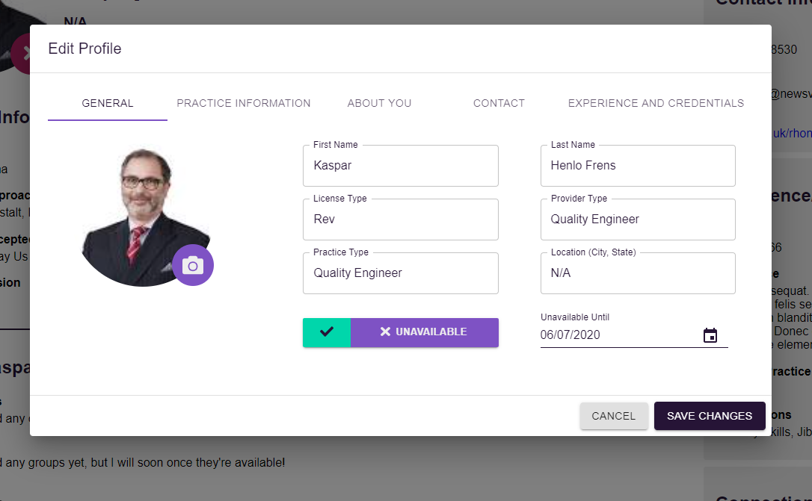
    > 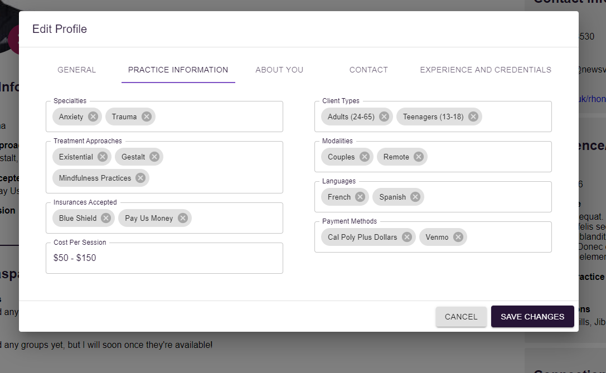
    > 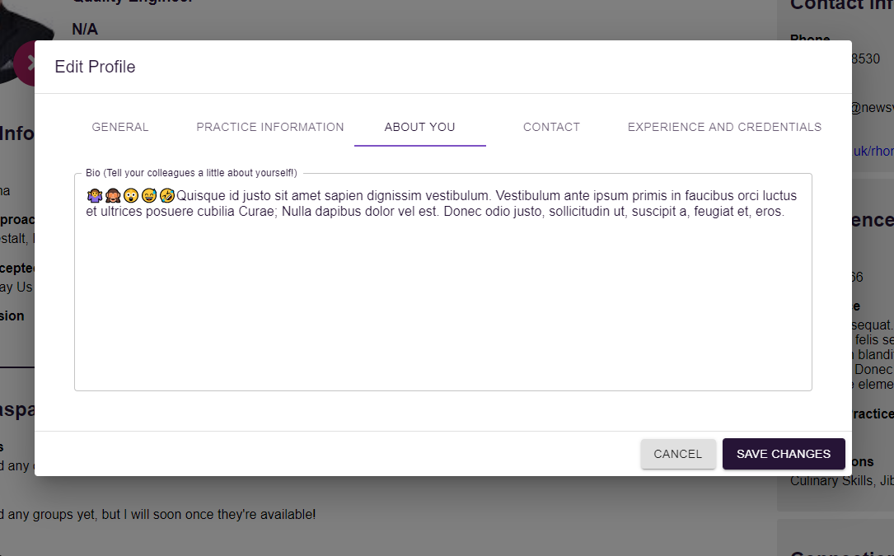
    > 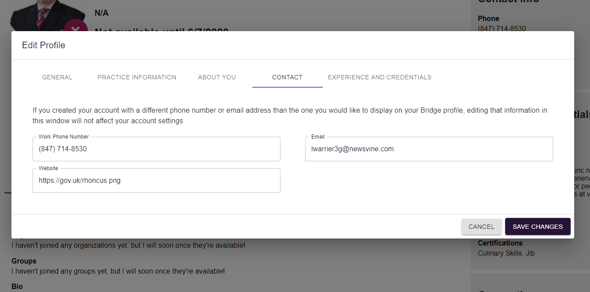
    > 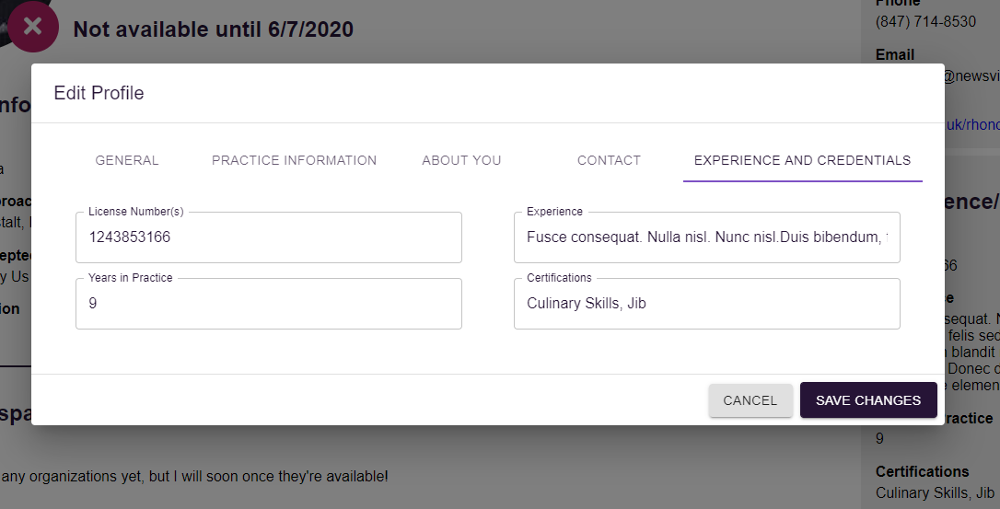 

4. After making changes and reviewing them, you can select the “Save Changes” button on the bottom right of the modal to push your profile changes to our system. If you wish to stop editing and remove any changes, simply select the "Cancel" button located to the left of "Save Changes." This will bring up a confirmation modal above asking you if you truly desire to "Discard Changes" or if you would like to "Keep Editing" and keep the edit modal present.

    > 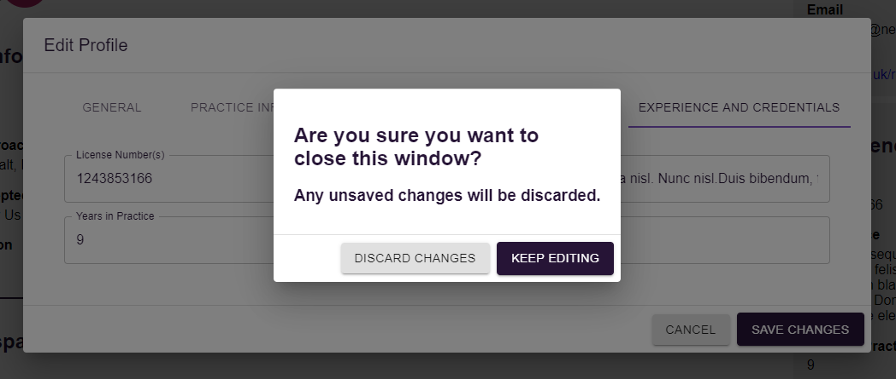   

## Editing Your Availability
1. Find the navigation bar on the left hand side.
2. Above the profile icon on the bottom of the bar, your availability can be easily toggled to your preferred status. The check represents being available, and the X represents being unavailable.

    > 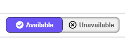

3. To add an "Unavailable Until" date, you must first toggle yourself as unavailable. This will reveal a date input field and a calendar icon which can be clicked to select the date you will be available.

    > 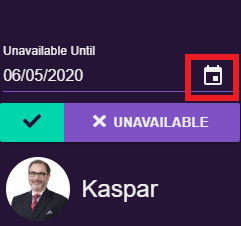 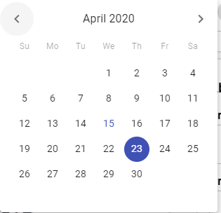
