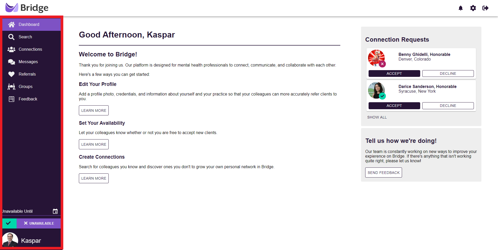
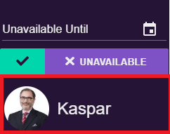
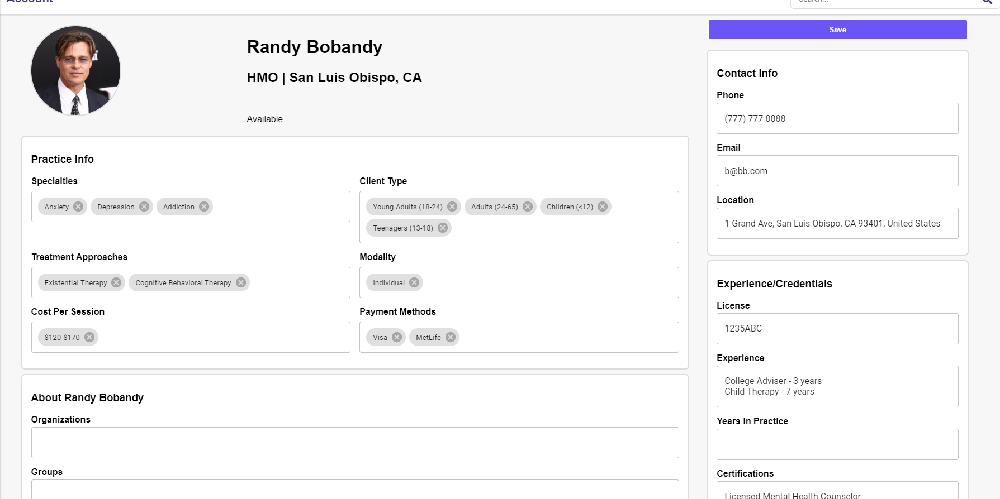
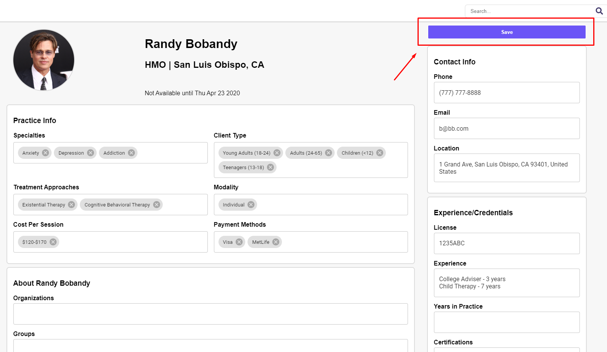

# Profile Management

---

## Accessing your profile

1. Find the navigation bar on the left hand side.

    > 

2. Select your icon on the bottom of the navigation bar. The navigation bar can be either collapsed or expanded.

    > 

## Accessing someone else’s profile

1. When you see a listing of other clinicians, whether it be through the search feature on the upper right of the website, on the list of connections, or on a profile, simply click on the user’s icon to be moved to their profile. This will allow you to refer, connect, view their information, among other features.

## Editing your profile

1. Navigate to your own profile (see Accessing your profile above).
2. Hit the “Edit” button in the upper right corner of your profile.

    > 

3. Your profile will now have text boxes for each section. You may add, delete, or edit the information in each field.

    > 

4. After making changes and reviewing them, navigate back to the upper right hand side of the site and select the “Save” button

    > 

## Editing your availability
1. Find the navigation bar on the left hand side.
2. Above the profile icon on the bottom of the bar in both collapsed and expanded view, change your availability to your preferred status. The check will represent available, and the X will represent unavailable.

    > 

3. To change the unavailable until date, make sure the navigation bar is expanded. Selecting unavailable will now reveal a date and a calendar. Click on the calendar to expand it to select your new date in which you will become available.

    >  
