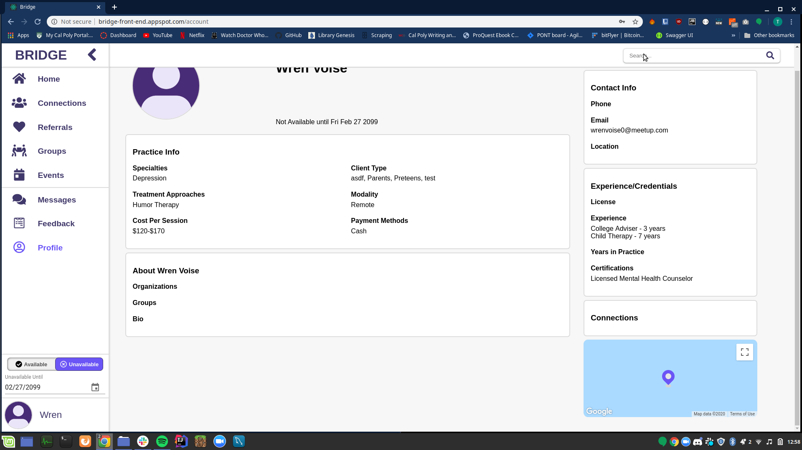
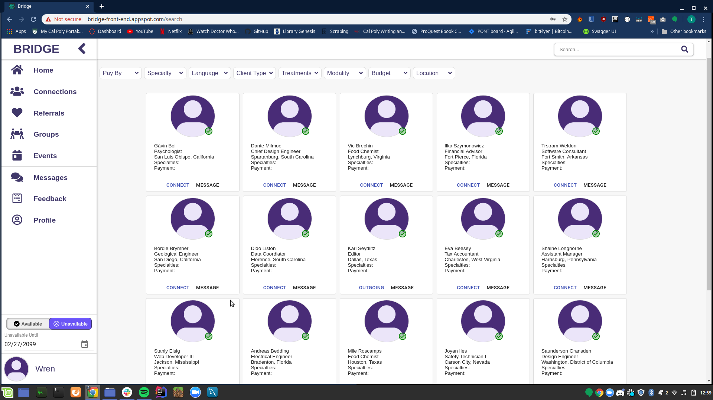
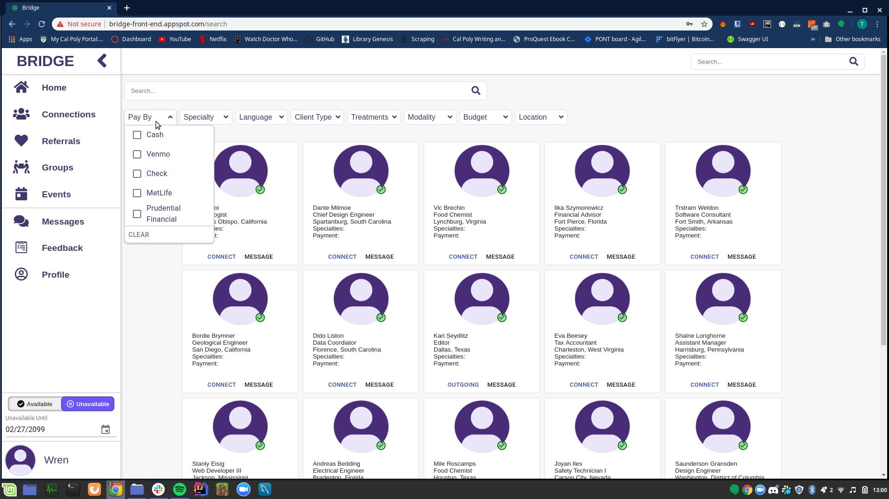
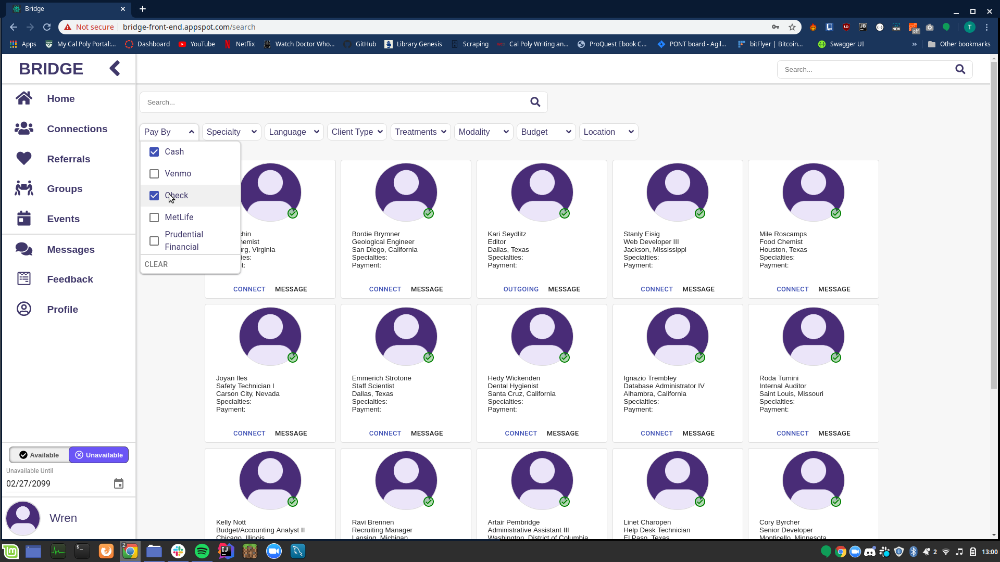
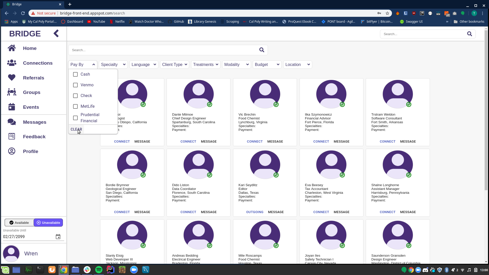
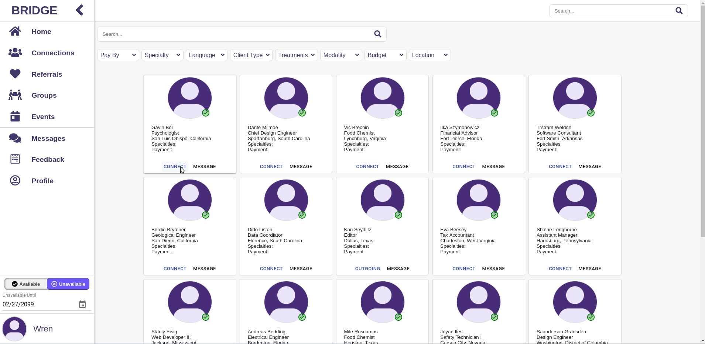

# Searching

---

## General Search
1. Navigate to the upper right hand side of the site to find a text box with a magnifying glass.

2. Enter information related to the person who you would like to search.
3. Hit “Enter” on your keyboard to see search results.

## General Search with filters
1. Repeat "General Search" to get to the general search page.
2. Click on a filter button (besides Budget and Location which are WIP) to open the filter options dropdown.

3. Select some filters from the dropdown (new results will load automatically).

## Clearing search filters
1. Repeat "General Search with filters" to get to add filter options.
2. Click the clear button at the bottom of the dropdown (new results will load automatically).

## Adding a new connection
1. Repeat "General Search" to get to the general search page.
2. Click the “connect” button on a result.

3. Refer to the "Connections" how-to page to see the outgoing connection in your connections list
